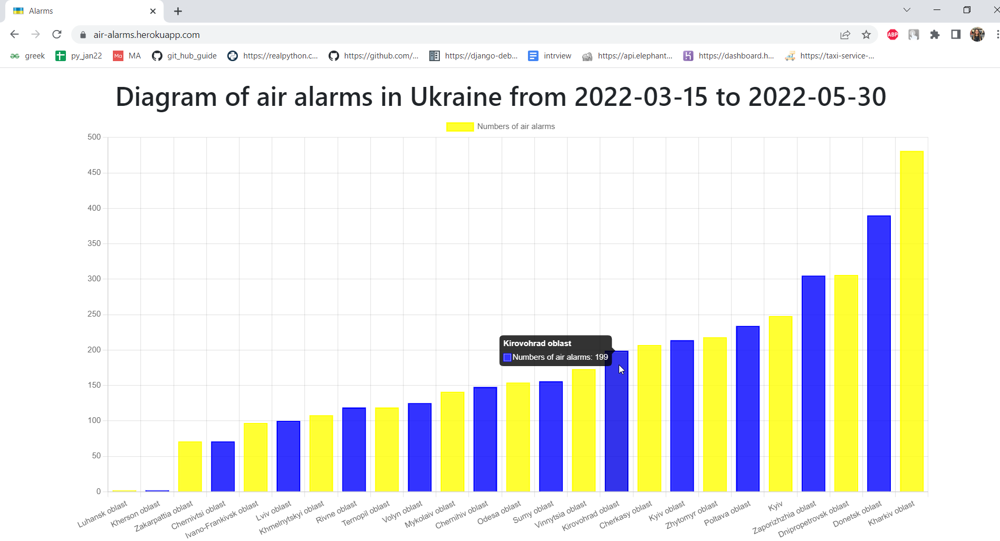

# Air alarms app

Web application for displaying statistics of air alarms by regions of Ukraine

## Check it out

[Air alarms app deployed to Heroku](https://air-alarms.herokuapp.com/)

## Installation

Python3 must be already installed

```shell
git clone https://github.com/liuda-chuzdiuk/air-alarms.git
python3 -m venv venv
source venv/bin/activate (on macOS) & venv\Scripts\activate (on Windows)
pip install -r requirements.txt
python3 manage.py makemigrations
python3 manage.py migrate
python manage.py runserver # starts Django Server
```

## Features

Bar chart of air alarms in the regions of Ukraine by their number in real time

## Demo

